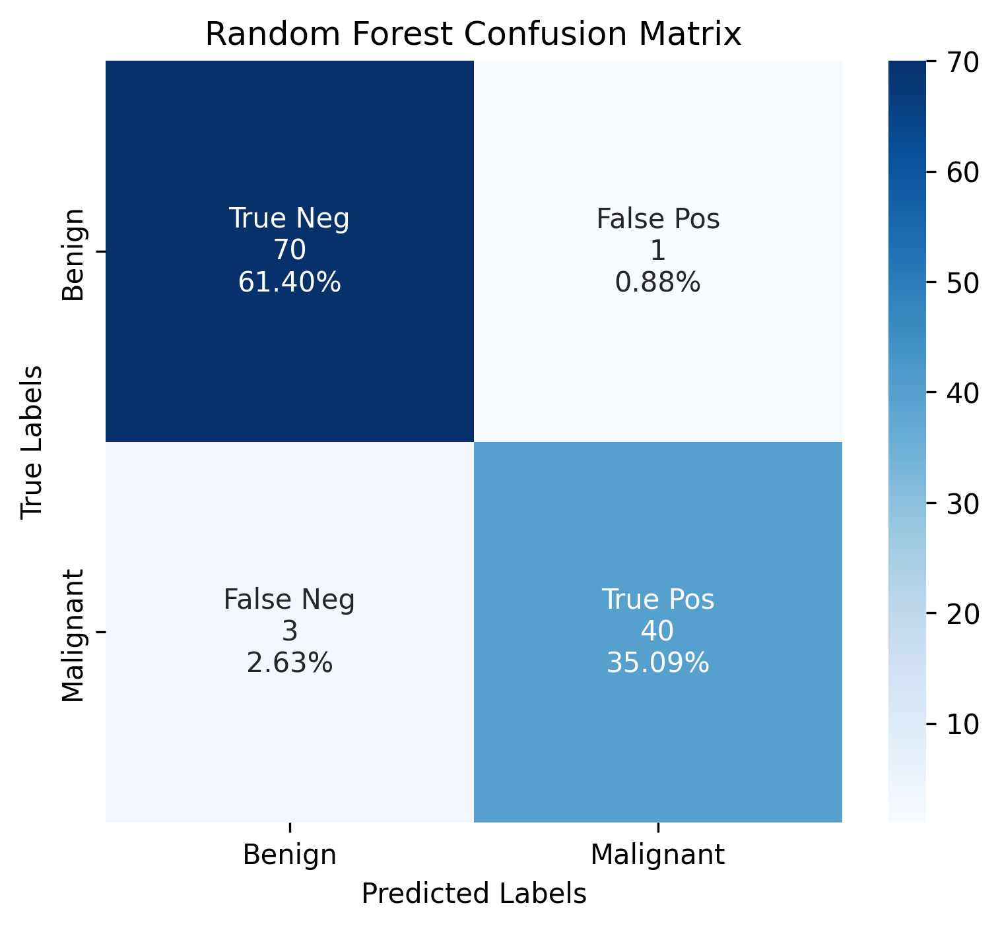
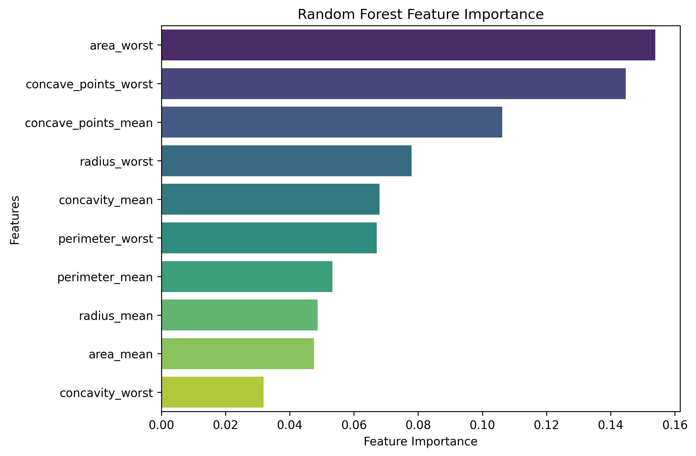

# 🎗 Breast Cancer Classification

A machine learning project that classifies breast cancer diagnoses using supervised learning algorithms. This project compares multiple classification models to identify the most accurate approach for tumour diagnosis.

---

## 📌 Project Overview

Breast cancer diagnosis can be improved using machine learning by analysing clinical features extracted from tumour samples. This project uses the Breast Cancer Wisconsin Diagnostic Dataset to train and evaluate several supervised learning algorithms.

The workflow includes:

- Data preprocessing
- Exploratory Data Analysis (EDA)
- Feature scaling
- Model training
- Model evaluation
- Feature importance analysis

---

## 🛠 Technologies Used

- Python
- Jupyter Notebook
- Pandas
- NumPy
- Matplotlib
- Seaborn
- Scikit-learn

---

## 🤖 Machine Learning Models

- Logistic Regression
- Random Forest
- K-Nearest Neighbours (KNN)

---

## 📂 Repository Structure

```
Breast_Cancer_Classification/
│
├── data/
│   ├── wdbc.data
│   └── wdbc.names
│
├── images/
│   ├── Correlation Heatmap.png
│   ├── Distribution of Tumour Diagnosis.png
│   ├── Random_Forest_Confusion_Matrix.png
│   └── Random_Forest_Feature_Importance.png
│
├── notebook/
│   └── Breast_Cancer_Classification.ipynb
│
├── report/
│   └── Breast_Cancer_Classification.pdf
│
├── README.md
└── LICENSE
```

---

## 📊 Results

Among the evaluated models, **Random Forest** achieved the strongest overall classification performance, demonstrating excellent predictive accuracy for distinguishing benign and malignant tumours.

---

## 📈 Visualizations

### Correlation Heatmap


The heatmap illustrates relationships between tumour features and highlights highly correlated variables.

---

### Diagnosis Distribution


The dataset contains both benign and malignant tumour diagnoses used for supervised classification.

---

### Random Forest Confusion Matrix



The confusion matrix demonstrates the classification performance of the Random Forest classifier.

---

### Random Forest Feature Importance



Feature importance identifies the variables that contribute most to accurate breast cancer diagnosis.

---

## 📄 Report

A detailed project report is available in the **report** folder.

---

## 📜 License

This project is licensed under the MIT License.
